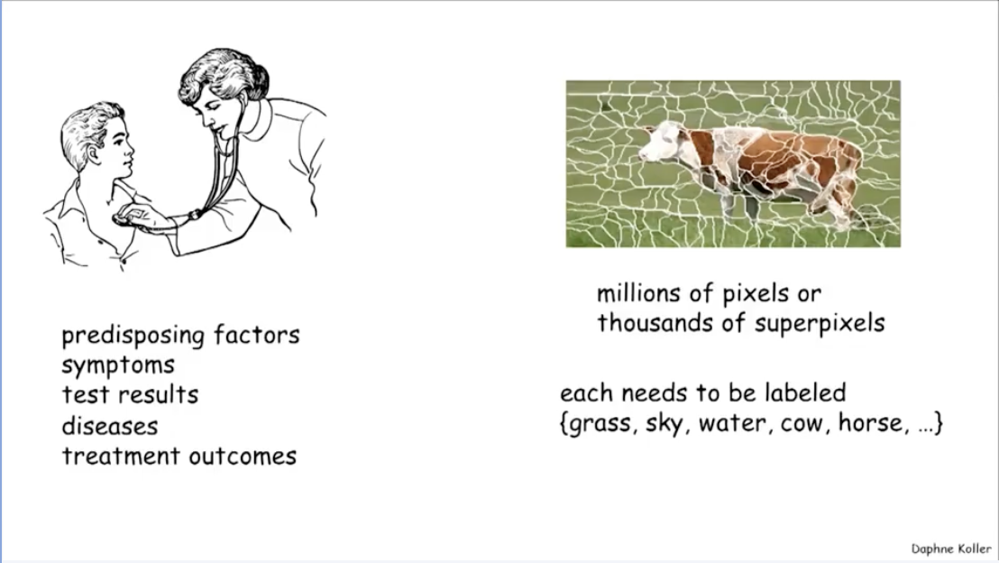
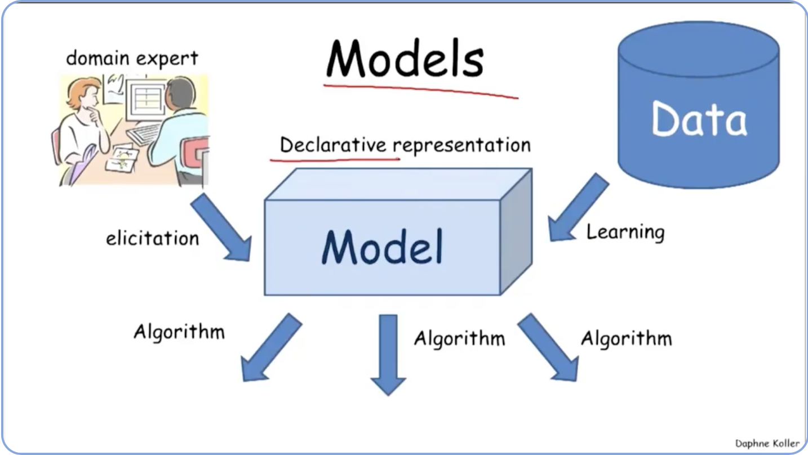
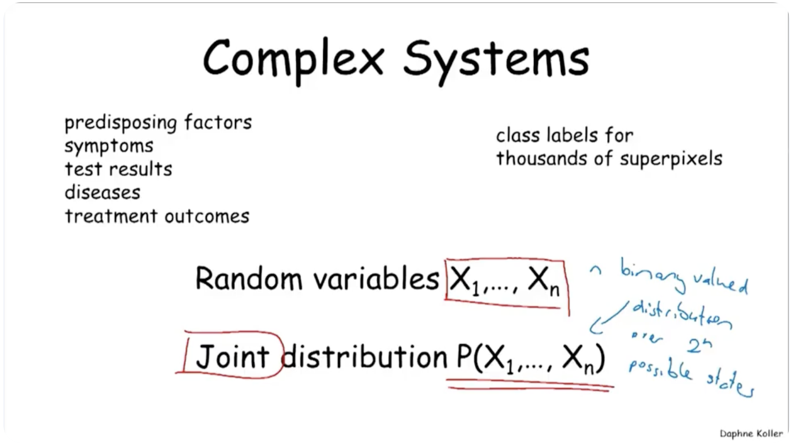

# Introduction and Overview

---

## Welcome

" ... you'll learn fundamental methods in this area of probabilistic graphical models. You'll also get to see and play around with a range of real world applications for which these methods have been applied and hopefully you will leave this class with an understanding of how to take these ideas and use them in your own work in problems that you care about ... "

---

## Overview and Motivation

### 2 applications: **medical diagnosis** and **image segmentation**

commonality:
1. very large number of variables that we have to reason about
   - doctor: predisposing factors, test results, possible diseases, and so on.
   - image segmentation: labels for these different pixels or these larger regions called superpixels.
2. fundamentally there is going to be significant uncertainty about the right answer, no matter how clever the algorithms that we design

**probabilistic graphical models** are a framework for dealing with this kind of application

what each of these words mean in the context of this framework:

### "Model"

The model is **a declarative representation of our understanding of the world**. So it is <u>a representation within the computer</u> that captures our understanding of what these variables are and how they interact with each other. And the fact that it's **declarative** means that the <u>representation stands on its own</u>, which means that we can look into it and make sense of it **aside from any algorithm that we might choose to apply on**.

So, why is that important? It's important because that **same representation**, that same model can then be used in the context of one algorithm that answers any one kind of question. Or other algorithms that might answer different kinds of questions or the same question in more efficient ways, or that make different trade-offs between accuracy and complicational cause.

The other advantage of having a <u>stand alone model</u> is that we can **separate out the construction of the model from the algorithms that are used to reason over it**. So, we can construct methodologies that
elicit these models *from a human expert* or ones that *learn it from historical data* using statistical machine learning techniques or a combination of the two. And once again, the separation between
the algorithm and the model and the learning in the model allows us to
tackle each of these problems separately.

### "Probabilistic"

The word probabilistic is in there because these models are designed to help us deal with *large amounts of uncertainty*. So uncertainty comes in many forms and for many different reasons:

**Parti1 knowledge of state of the world**: for example the doctor doesn't
get to measure every symptom or every test result and she's certainly uncertain about the diseases that the patient has.

**Noisy observations**: Uncertainty comes because of noisy observations. So even when we get to observe certain things like blood pressure, those observations are often subject to significant amounts of noise.

**Phenomena not coverd by our model**: Uncertainty also comes in because of <u>modeling limitations</u>, so we're going to have phenomena that are just not covered by our model. All sorts of different obscure diseases for example that might cause the same set of symptoms. It's impossible for us to write down the model that is so detailed that includes every possible contingency in every possible factor. And so you're going to have uncertainty and variability that is simply due to modelling limitations.

**Inherent Stochasticity**: And finally, some people would argue that <u>the world is inherently stochastic</u>. Certainly, if you go down to the quantum level, that's true. But even at a higher level, the modeling limitations of complicated systems are such that one might as well view the world as inherently stochastic.

### Probability theory

*Probability theory is a framework that allows us to deal with uncertainty in ways that are principled and that bring to bear important and valuable tools.* 

**Declarative representation with clear semantics**: So first, probabilistic models provide us again this word **declarative**. A declarative representation, that is stand alone, where you could look at a probability distribution and it has clear semantics that represent our uncertainty about different state that the world might be in. 

**Powerful reasoning patterns**: It also provides us with a toolbox comprising powerful reasoning patterns that include, for example, **conditioning** on new forms of evidence or **decision making** under uncertainty. 

**Established learning methods**: And because of the intricate connection between probability theory and statistics, you can bring to bear a range of **powerful learning methodologies from statistical learning** to allow us to *learn these models effectively from historical data*. Avoiding the need for a human to specify every single aspect of the model by hand.

### Complex Systems

The word graphical is here from the perspective of computer science, because **probabilistic graphical models are a synthesis between ideas from probability theory in statistics and ideas from computer science**. And the idea here is to use the connections computer science, specifically that of <u>graphs to allow us to represent systems that are very complicated that involved large numbers of variables</u>.

And we'd already seen those large number of variable in both of the applications that we use examples. Both in the medical example, as well as in the image segmentation example.

And so in order to **capture probability distributions over spaces involving such a large number of factors**, we need to have **probability distributions over random variables**. And so the focus of this class and what we'll do for most of it is to **think about the world as represented by a set of random variables**

$$
\text{ Random Varibles } X_1, X_2, \ldots, X_n
$$

each of which captures some facet of the world. So, one symptom that may be present or absent, or a test result that might have a continuous set of possible values or a pixel that might have one of several labels.

So each of these is a random variable and <u>our goal is to capture our uncertainty about the possible states of the world in terms of their probability distribution or what's called a **joint distribution** over the possible assignments to the set of random variables</u>.

Now, the important thing to realize when looking at this, is that even in the simplest case where each of these is, say, binary valued, which is not on the case, but say just for sake of the argument. If you have n binary value variable then this is a distribution, Over to to the n possible states of the world. One for each possible assignment. And so we have to deal with objects that are **intrinsically, exponentially large**. And our only way to do that is by **exploiting data structures that encode, that use ideas from computer science in this case to exploit the structure and distribution and represent and manipulate it in an effective way.**

## Graphical Models

