# Bayesian Networks (Directed Models)

## Bayesian Network Fundamentals

### Semantics & Factorization

$P(G, D, I, S, L)$

- **G**rade
- Course **D**iffulcty
- Student **I**ntelligence
- Student **S**AT
- Reference **L**etter

How to construct the dependencies?

A representation of how we believe the world works.

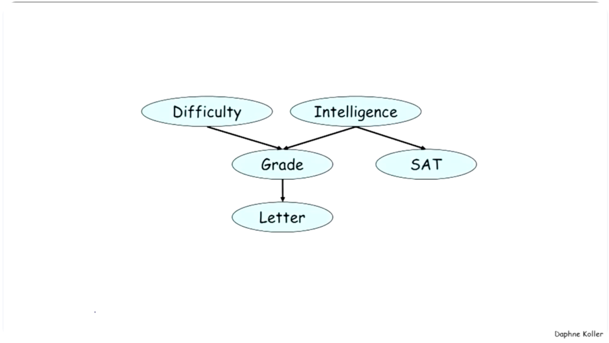

**How to turn this into a probability distribution:**

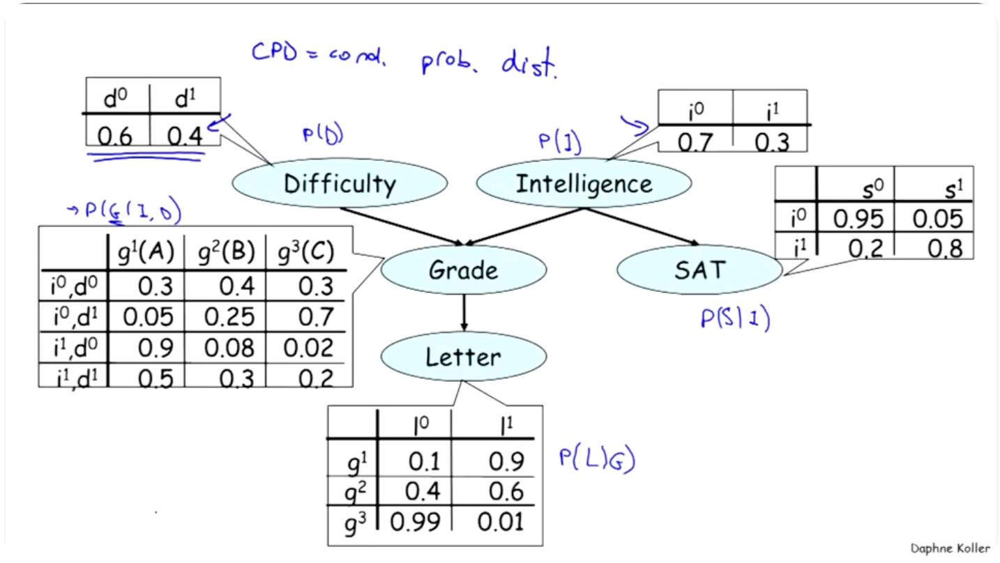

**How this Bayesian network produces a joint probability distribution over these five variables:**

$$
P(G, D, I, S, L) = P(D)P(I)P(G|I, D)P(S|I)P(L|G)
$$

**factor product**: this is actually a factor product in exactly the same way that we just defined. So here, we have five factors, they have **overlapping scopes** and what we end up with is a factor product that gives us a big, big factor whose scope is five variables. <u>So what does that translate into when we apply the chain rule for Bayesian networks in the context of the particular example?</u>

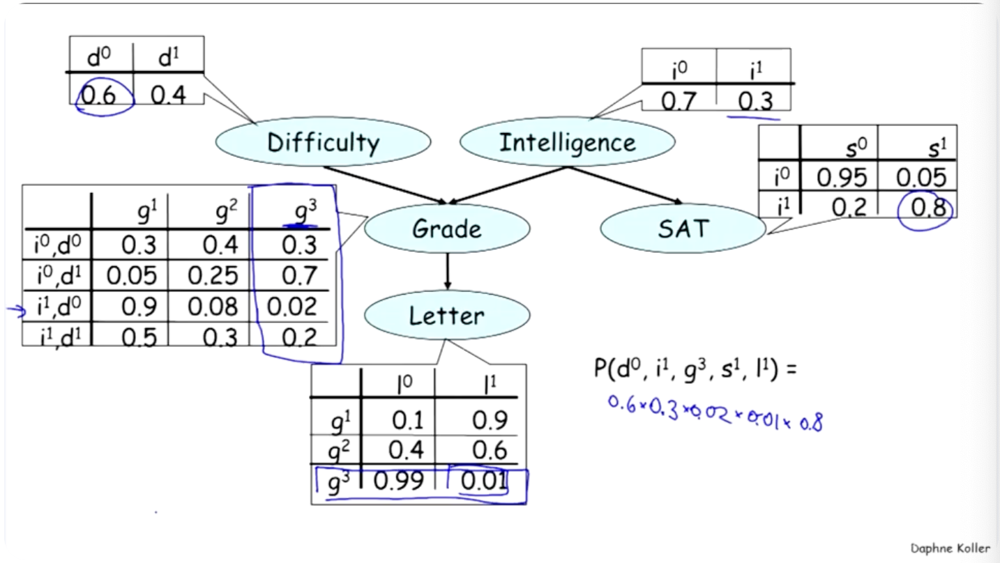

$$
P(d^0, i^1, g^3, s^1, l^1) = 0.3 \times 0.3 \times 0.02 \times 0.01 \times 0.8
$$

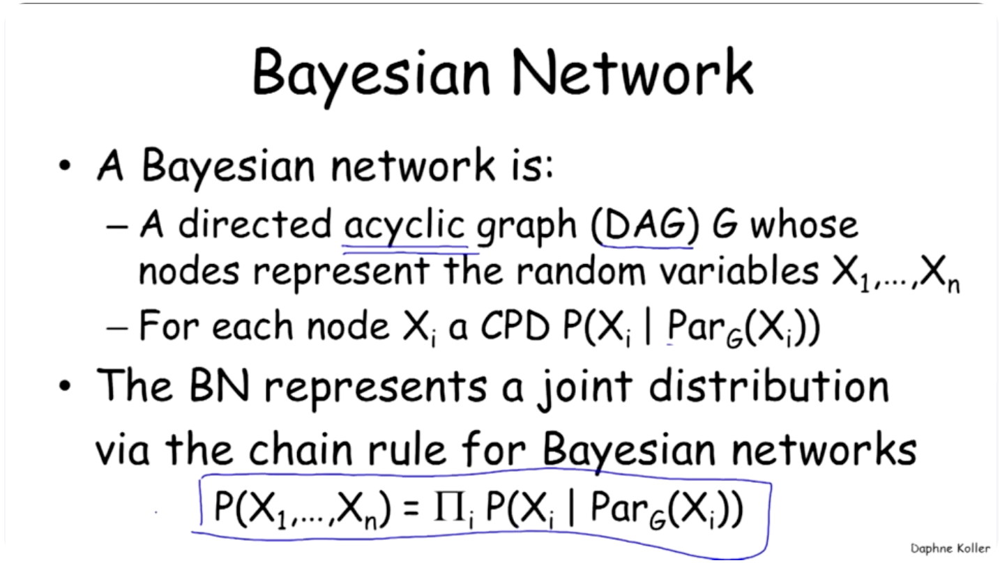

这样引入BN后：证明 BN is a legal distribution: $P \geq 0$ and $\sum P = 1$

$P \geq 0$: Trivially true because all the factors are non-negative.

$$
\begin{align}
  \sum_{G, D, I, S, L} P(G, D, I, S, L) &= \sum_{G, D, I, S, L} P(D)P(I)P(G|I, D)P(S|I)P(L|G) \\
  &=\sum_{D, I, G, S} P(D)P(I)P(G|I, D)P(S|I) \sum_{L} P(L|G) \\
  &=\sum_{D, I, G} P(D)P(I)P(G|I, D)  \sum_{S} P(S|I) \\
  &=\sum_{D, I} P(D)P(I) \sum_{G} P(G|I, D)\\
  &=\sum_{D, I} P(D) P(I) = 1
\end{align}
$$

trick 1: (1) **"push in" the summation** over the variables that are not in the scope of the factor that we're looking at.

trick 2: (2) by definition of CPDs: $\sum_{G} P(G|I, D) = 1$, removing variables that are not relevant

#### P Factorizes over G

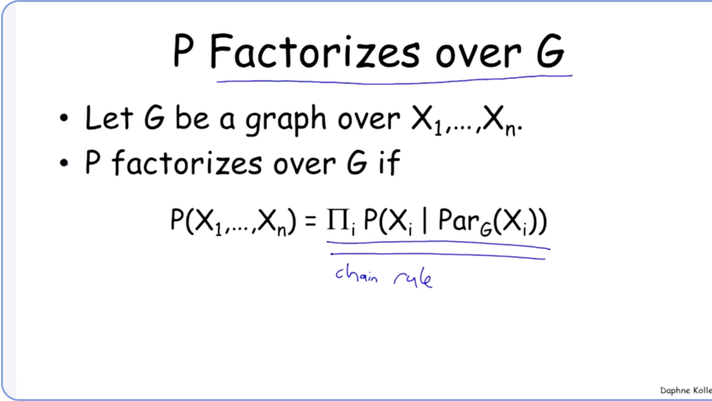

We're going to say that a distribution P factorizes over G, means **we can represent it over the graph G if we can encode it using the chain rule for Bayesian networks**. So the distribution factorizes over a graph $G$ if I can represent it in this way **as a product of these conditional probabilities**.

- Let $G$ be a graph over $X_1, ..., X_n$
- $P$ factorizes over $G$ if
$$
P(X_1, \dots, X_n) = \prod_{i=1}^{n} P(X_i | \text{Par}_{G}(X_i))
$$

#### Genetic Inheritance

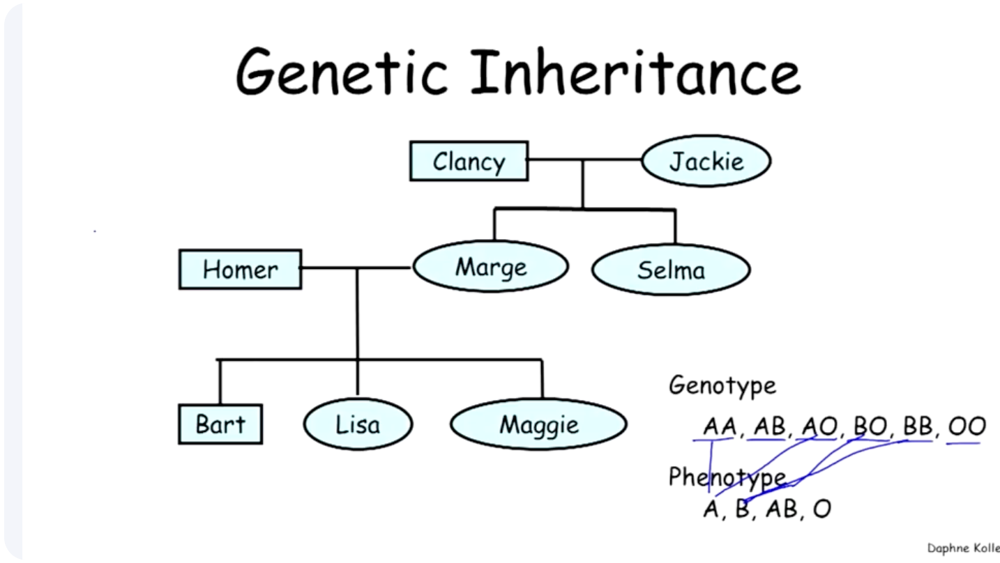

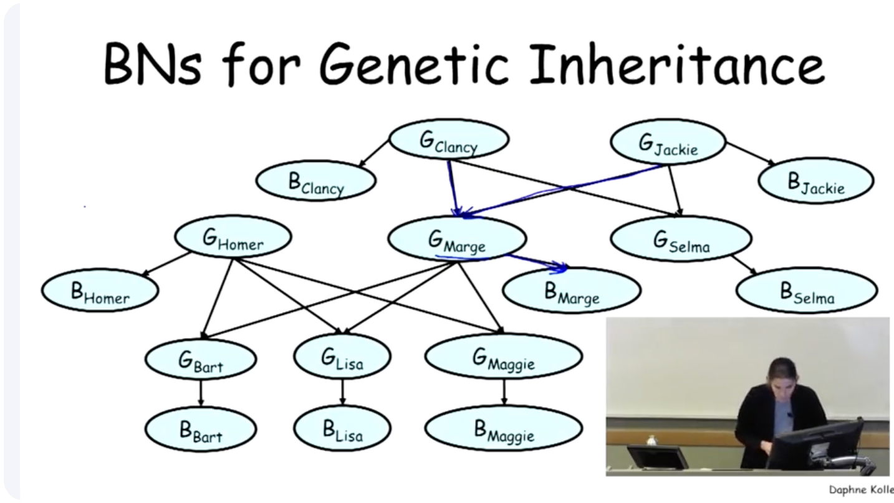

---

### Reasoning Patterns

#### Causual Reasoning

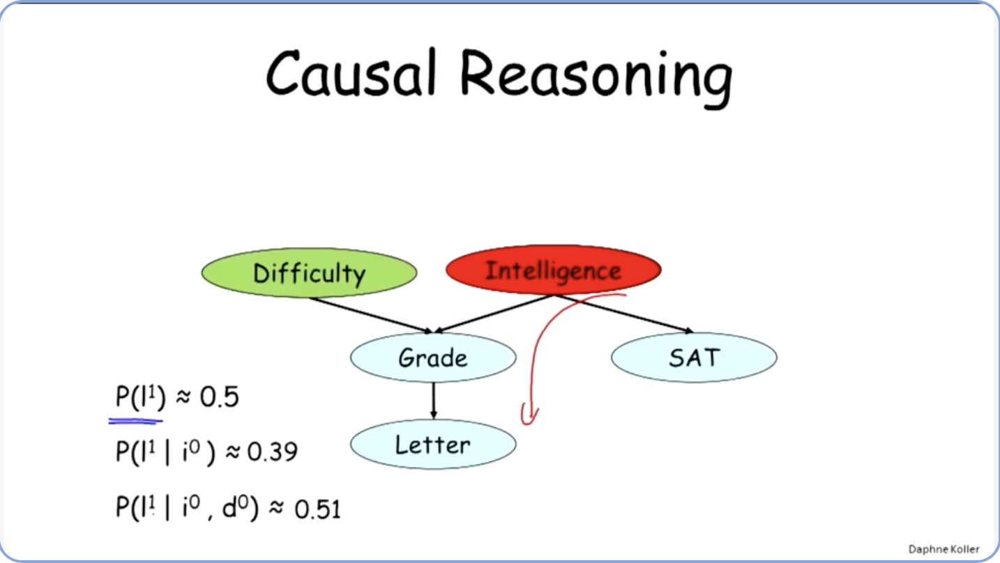

And let's look at some of the probabilities that one would get if you took this Bayesian network, **produced the joined distribution using the chain rule for Bayesian network**. And now compute it say the values of different marginal probabilities.

#### Evidential Reasoning

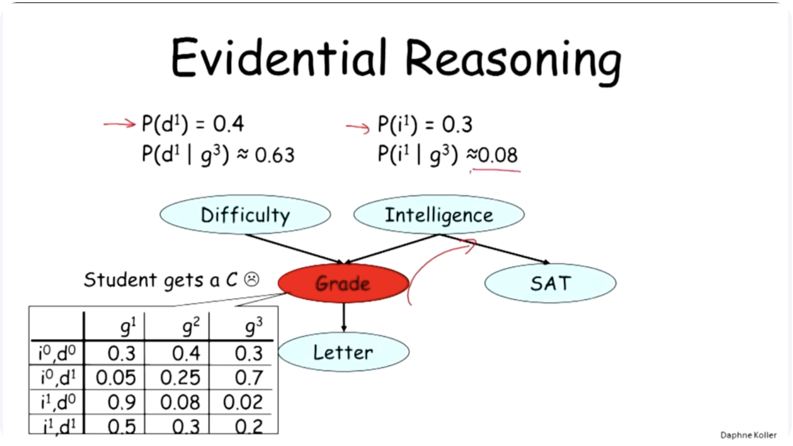

Evidential goes from the **bottom up**. So we can in this case condition on the grade and ask what happens to the probability of, of variables that are <u>parents</u> or, or general ancestors of the grade

新的信息加入（后验），更新先验的认知？

#### Intercausal Reasoning

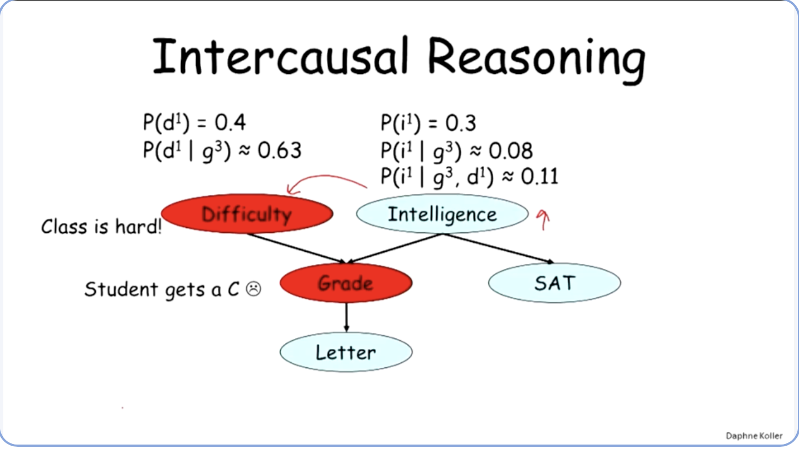

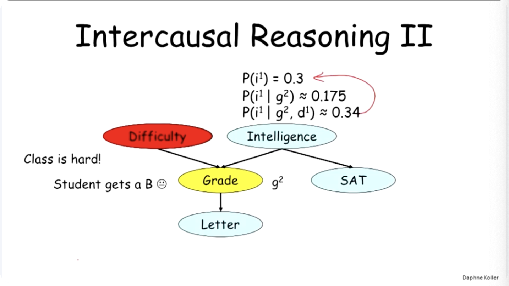

And that is reasoning that is called intercausal because effectively it's **flow of information between two causes of a single effect**.

So intercausal reasoning is a little hard to understand, I mean it's a little bit mysterious because after all <u>there's no edge between them</u> how would one cause affect another.

条件于 $Y$ 前，$X_1, X_2$ 独立，但是条件于 $Y$ 后（删掉了第一行$Y=0$），$X_1, X_2$不独立！

$$
P(X_1 = 1) = \frac{2}{3}, P(X_2 = 1) = \frac{2}{3}\\
\text{conditioned on } X_2 = 1, P(X_1 = 1 | X_2 = 1) = \frac{1}{2}
$$

**explaining away**: And it's when <u>one cause explains a way reasons that made me suspect a different cause</u>.

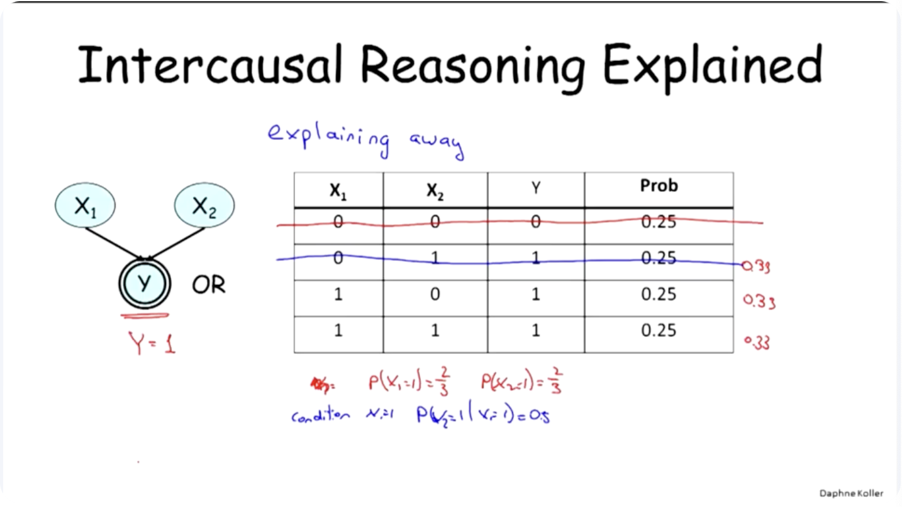

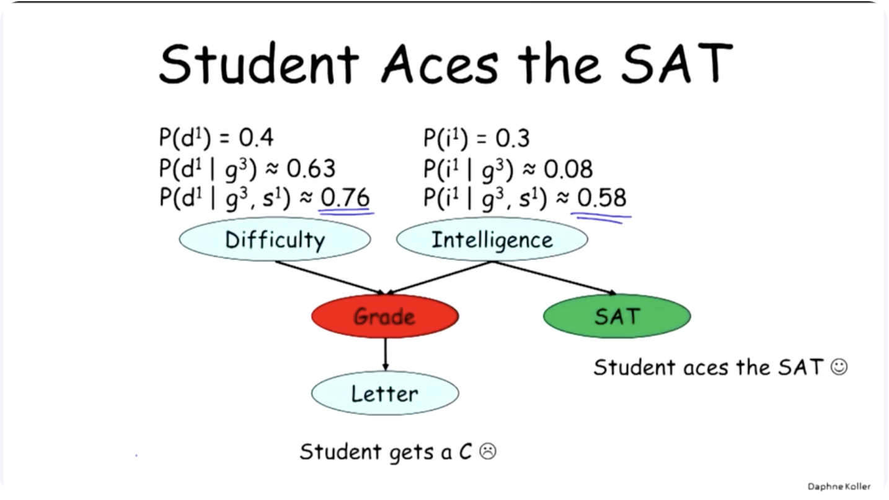

### Flow of Probabilistic Influence

So we've seen reasoning patterns where intuitively, at least that's how we argued, **probabilistic influence kind of starts in one node and flows through the graph to another node**(而且这里不一定是按照有向图的方向来flow？可以倒流？). Now it might seem like, you know, a bunch of hand waving but it turns out this is actually, exactly what goes on in a Bayesian network.

## Bayesian Networks: Independencies

### Conditional Independence

$$
X, Y, Z \\
X \perp Y | Z \\
P(X, Y|Z) = P(X|Z)P(Y|Z) \\
P(X | Y, Z) = P(X | Z) \\
P(Y | X, Z) = P(Y | Z) \\
P(X, Y, Z) \propto \phi_1(X,Z) \phi_2(Y,Z)
$$

本质上是对概率空间的划分，given $Z$，便得到了一个新的概率空间？

### Independencies in Bayesian Networks

#### Independence & Factorization

#### Flow of influence & d-separation

Definition: $X$ and $Y$ are d-separated in $G$ given $Z$ if there is no active trail in $G$ between $X$ and $Y$ given $Z$

Notation: $\text{d-sep}_G(X, Y | Z)$

exercise

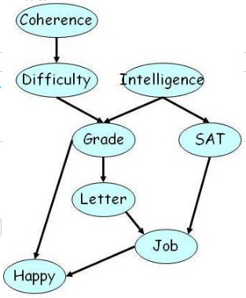

**If we observe L, the V-structure at G is activated**

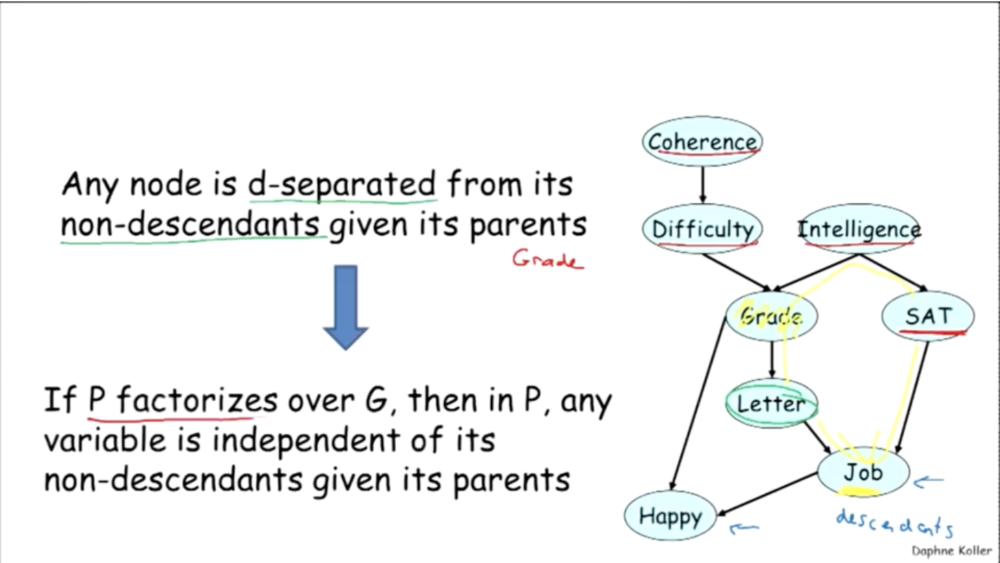

Any node is d-separated from its non-descendants given its parents.

If P factorizes over G, then in P, any variable is independent of its non-descendants given its parents.

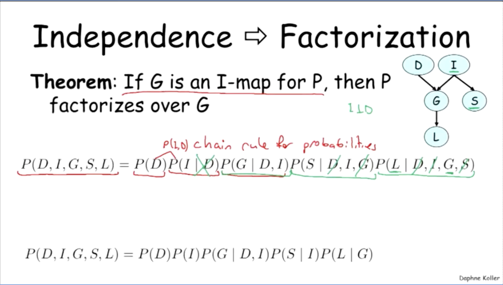

#### I-map

I-map 包含了所有的独立性信息，但是不一定是最小的

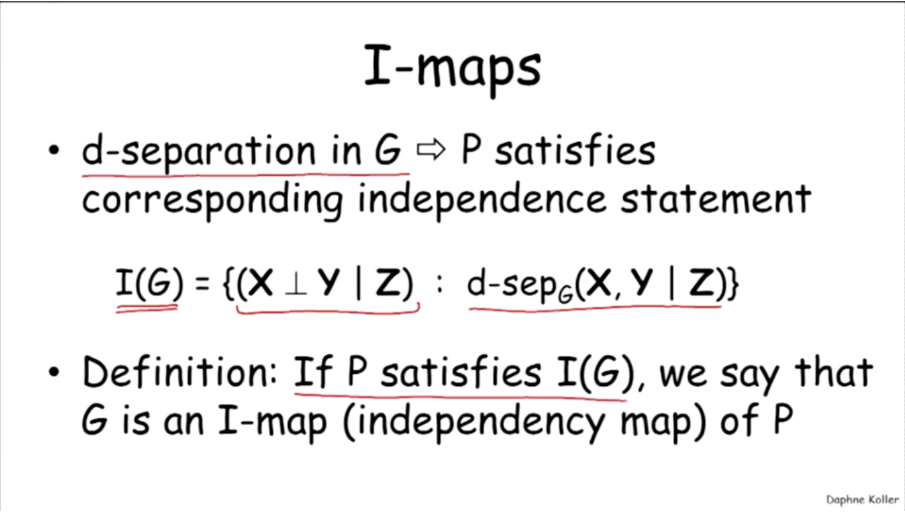

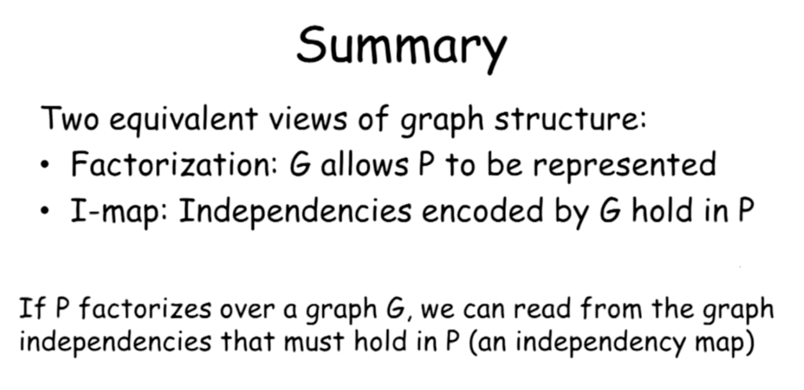

---

### Naive Bayes

One subclass of Bayesian Networks is the class called as Naive Bayes or sometimes even more derogatory, Idiot Bayes. As we'll see Naive Bayes models are called that way because they make independence assumptions that indeed very naive and orally simplistic. And **yet they provide an interesting point on the tradeoff curve**, be, of model complexity that sometimes turns out to be surprisingly useful.

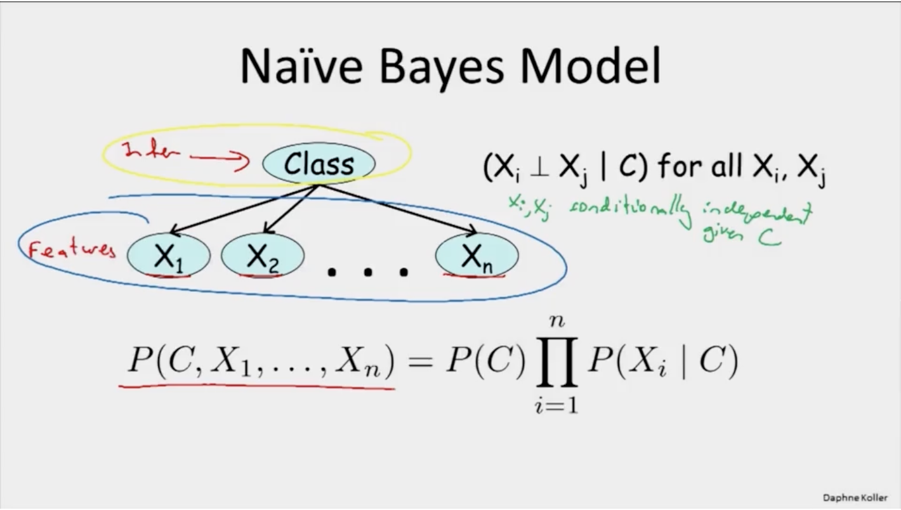

#### Bernoulli Naive Bayes for text

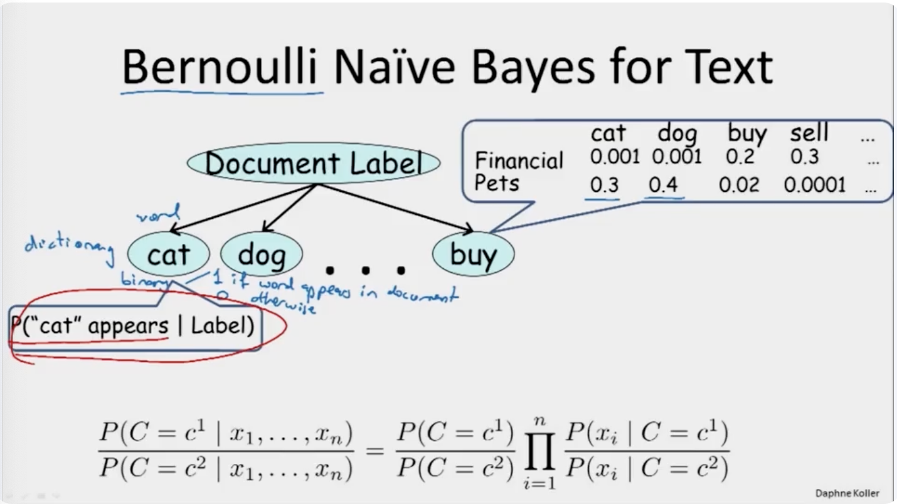

binary, 某个单词在某个文档中 出现/不出现

#### Multinomial Naive Bayes for text

word in which document

#### Summary

- Simple approach for classification
  - Computationally efficient
  - Easy to construct
- Surprisingly effective in domains with many weakly relevant features
- Strong independence assumptions reduce performance when many features are strongly correlated

## Baeysian Networks: Knowledge Engineering

### Application - Medical Diagnosis

#### Medical Diagnosis: Pathfinder (1992)

- Help pathologists diagnose lymph-node pathologies
- Pathfinder I: Rule-based system
- Pathfinder II: Naive Bayes
- Pathfinder III: Naive Bayes w/ better knowledge engineering
- No incorrect zero probabilities

> "In reality, events can have 0 probabilities; the problem is that it is very difficult to be sure of which events truly have 0 probabilities and which events have small but non-zero probabilities. Wrongly ascribing a 0 probability to an event means that no amount of evidence to the contrary can change things, which is dangerous; on the other hand, if we assign an event a low but non-zero probability and it turns out that the event actually has a 0 probability in reality, not much harm is done because the event is improbable anyway."

- Better calibration of conditional probabilities
- Pathfinder IV: Full Bayesian network
  - Removed incorrect independencies
  - Additional parents led to more accurate estimation of probablities
- BN model agreed with expert panel in 50/53 cases, vs 47/53 for naive Bayes model
- Accuracy as high as expert that designed the model

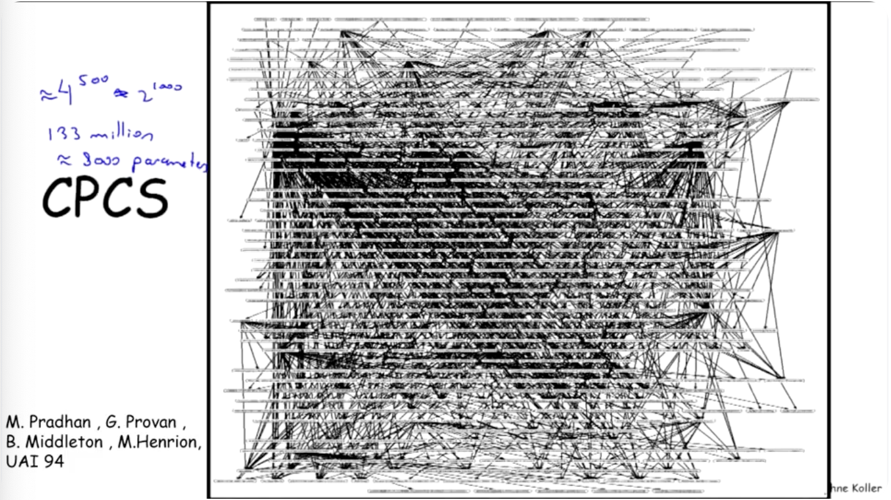

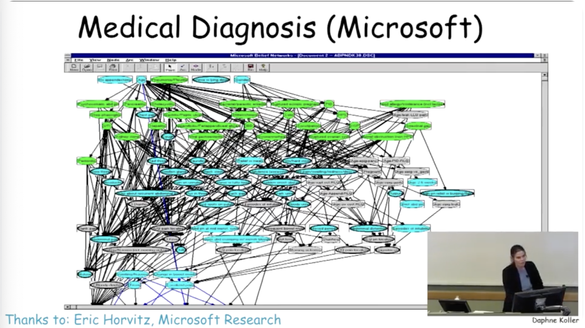

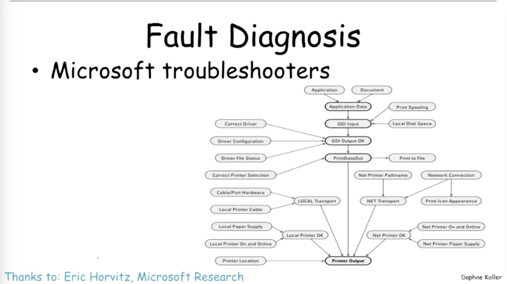

系统各种错误检查/诊断，很多都是一个BN

“执果索因”

easy to design and maintain vs. tree models

### Knowledge Engineering Example - SAMIAM

