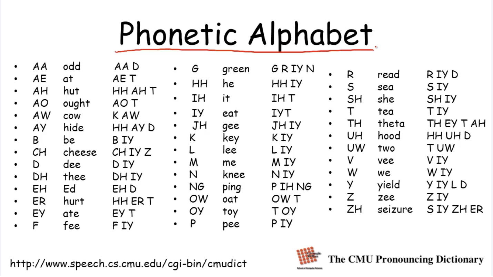

# Template Models for Bayesian Networks

## Overview of Template Models

### Genetic Inheritance

 

a lot params sharing between models & within model

### NLP Sequence Models

### Image Segmentation

sharing across pixels and pairs of super pixels

between within model

### The University Example

### Robot Localization

time series

position at time t changes over time

we expect the dynamics are fixed

### Template Variables

- Template variable $X(U_i, \cdot, U_k)$ is instantiated (duplicated) multiple times
  - location(t), sonar(t)
  - genotype(person), phenotype(person)
  - label(pixel)
  - difficulty(course), grade(student), grade(course, student)

### Template Models

---

## Temporal Models - DBNs

**evolves over time**

### Distributions over Trajectories

discretize time

- Pick time granularity $\Delta$
- $X^{(t)}$ - variable X at time t$\Delta$
- $X^{(t:t')} = \{X^{(t)} \dots X^{(t')}\}$

- Want to represent $P(X^{(t:t')})$ for any $t$, $t'$

### Markov Assumption

chain rule for probability:

$$
P(X^{(0:T)}) = P(X^{(0)}) \prod_{t=0}^{T-1}P(X^{(t+1)}|X^{(0:t)})
$$

这里没有做假设，只是按照时间的形式展开了联合概率

time flows forward

---

**forgetting:**

$$
(\underbrace{X^{(t+1)}}_{\text{next step}} \perp \underbrace{X^{(0:t-1)}}_{past} | \underbrace{X^{(t)}}_{present})
$$

$$
P(X^{(0:T)}) = P(X^{(0)}) \prod_{t=0}^{T-1}P(X^{(t+1)}|X^{\color{red}{(t)}})
$$

有些过强了，比如robot trajectory，这种假设甚至忽略了速度

改进：

1. enrich state by adding $V^t$ - velocity at time t
2. adding dependnecies that go further back in time --- Semi-Markov Models

### Time Invariance

- Template probability model $P(X'|X)$: $X'$ next time point, $X:$ present time point
dynamic of the system don't change over time, use **template model**
- For all t:
  - $P(X^{(t+1)}|X^{(t)}) = P(X'|X)$

e.g. traffic, time of day, day of week, football match

**enrich the model by including above variables..**

### Template Transition Model

inter time slice, intra time slice

### Ground Bayesian Network

### 2-time-slice Bayesian Network

- A transition model (2TBN) over $X_1, \dots, X_n$ is specified as a BN fragment such tha:
  - the nodes include $X_1', \dots, X_n'$ and a subset of $X_1, \dots, X_n$ (the time t variables that directly affects state at t+1)
  - Only the nodes $X_1', \dots, X_n'$ have parents and a CPD
- The 2TBN defines a conditional distribution

$$
P(X'|X) = \prod_{i=1}^n P(X_i'| \text{Pa}_{X_i'})
$$

### Dynamic Bayesian Network

- A dynamic Bayesian network (DBN) over $X_1, \dots, X_n$ is defined by a
  - 2TBN $\text{BN}_{\rightarrow}$ over $X_1, \dots, X_n$
  - a Bayesian network $\text{BN}^{(0)}$ over $X_1^{(0)}, \dots, X_n^{(0)}$

### Ground Network

- For a trajectory over $0,\dots,T$ we define a ground (unrolled network) such that
  - The dependency model for $X_1{(0)}, \dots, X_n^{(0)}$ is copied from $\text{BN}^{(0)}$
  - The dependency model for $X_1{(t)}, \dots, X_n^{(t)}$ for all $t \ge 0$ is copied from $\text{BN}_{\rightarrow}$

### Summary

Dynamic Bayesian networks provides us with **a language for encoding structured distributions over time**. And by making the assumptions of the Markovian evolution as well as time invariance, you can use a single compact network to allow us to code arbitrarily long transitions over arbitrarily long time sequences.

They make assumptions that may require qppropriate model (re)design: (e.g. adding variables)
- Markovian assumption
- Time invariance

## Temporal Models - HMMs

### Hidden Markov Models

transition model

observation model

numerous applications:
- robot localization
- speech recognition
- biological sequence analysis
- text annotation

### Robot Localization

### Speech Recognition

### Word HMM

### Phone HMM

### Recognition HMM

So this is a probabilistic model that tells us how speech might be constructed of first words, then phones within words, and then finally pieces, little bits of the phone that we see in this in the phone HMM that we saw previously. 
And, this is a generative model of speech, but what happens is that as you feed in evidence about the observed acoustic signal over here, and you run probabilistic inference over this model. What you get out is the most likely set of words that gave rise to the observed speech signal.

### Summary

- HMMs can be viewd as a subclass of DBNs
- HMMs seem unstructured at the level of random variables
- HMM structure typically manifests in **sparsity and repeated elements** within the transition matrix
- HMMs are used in a wide variety of applications

---

## Plate Models

### Modeling Repetition

### Nested Plates

### Overlapping Plates

### Explicit Parameter Sharing

### Collective Inference

### Plate Dependency Model

- For a template variable $A(U_1, \dots, U_k)$
  - Template parents $B_1(U_1), \dots, B_m(U_m)$

指标变量 indices parents $\sub$ children, 不能用 unbounded 量
(见plate dependency model)

### Ground Network

Let $A(U_1, \dots, U_k)$ with parents $B_1(U_1), \dots, B_m(U_m)$
- for any instantiation $u_1, \dots, u_k$ of $U_1, \dots, U_k$ we would have:

### Plate Dependency Model

Let $A(U_1, \dots, U_k)$ with parents $B_1(\textbf{U}_1), \dots, B_m(\textbf{U}_m)$
- For each $i$, we must have $\textbf{U}_i \subseteq U_1 \cup \dots \cup U_k$
  - No indices in parent that are not in child (cannot have "free-floating" variables)

remark: \textbf{U} is a set of variables, U is a single variable

Q: 是否要求 $\textbf{U}_i$ 互不相交？
Q: 是否要求 $\bigcup_{i=1}^{m} \textbf{U}_i = \bigcup_{i=1}^{k} U_i$

> answer by gemini 2.0 flash

> Q: Why is it not required that the $\textbf{U}_i$ are disjoint?

Index Sharing: Plate models are designed to represent repeated structures and relationships. Allowing the same index variable to appear in multiple parent template variables enables the model to capture dependencies that involve multiple aspects of the repeated entities.
Example: Consider a scenario where you have students and courses. A student's grade in a course might depend on both the student's ability ($\textbf{U}_1$ = {student}) and the difficulty of the course ($\textbf{U}_2$ = {course}). However, it might also depend on the interaction between the student and the course (e.g., some students do better in some courses than others). In this case, you might have a parent that depends on {student, course}. Thus, the 'student' and 'course' indices are "shared" between different potential parent sets.
Expressiveness: Disallowing overlap would severely limit the expressiveness of the plate model, preventing it from capturing complex interactions between the indexed entities.

> Q: Why is it not required that $\bigcup_{i=1}^{m} \textbf{U}i = \bigcup{i=1}^{k} U_i$?

Subset Dependency: A parent variable might only depend on a subset of the indices that the child variable is indexed by.
Example: Consider a model of students in a university. You might have a template variable Grade(student, course). However, a parent of Grade might be Difficulty(course). The Difficulty variable only depends on the course index, not the student index. Therefore, the union of the parent indices (course) is a subset of the child indices (student, course).
Ignoring Irrelevant Indices: Forcing the union of parent indices to equal the union of child indices would imply that every index is relevant to at least one parent, which is often not the case. Some indices might only be relevant to the child variable itself or to other relationships not explicitly modeled as parents.
Think of it this way: The child variable represents a more "complete" relationship, while the parents can represent contributing factors that might only focus on certain aspects of that relationship.
In summary, the flexibility to have overlapping index sets and for parents to depend on subsets of child indices is crucial for plate models to represent a wide range of real-world scenarios with complex dependencies and relationships between repeated entities.

### Summary

- Template for an **infinite set of BNs**, each induced by a different set of domain objects
- Parameters and structure are **reused** within a BN and across different BNs
- Models encode correlations across multiple objects, allowing **collective inference**
- Multiple "languages"(*This is a simple one, for example, it has this restriction on the parents not having variables that are not instantiated in the trial. And so for example, you can't represent temporal models here because X(T)-1 is not instantiated in the variable X(T). So you can't have X(T)-1 as a parent of x sub p*), each with different **trade-offs in expressive power**
